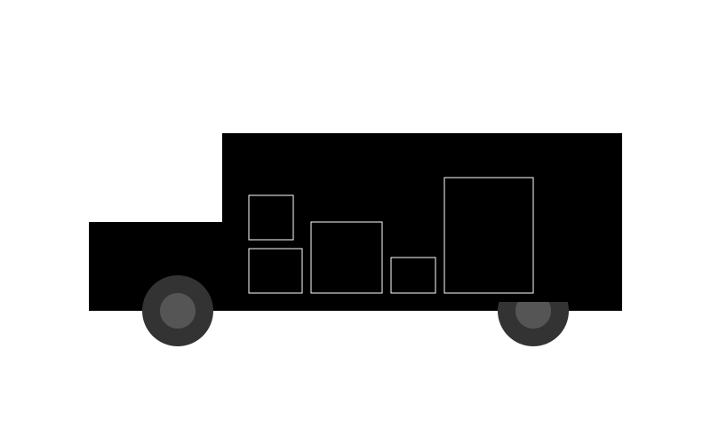

# 3D Isometric Editor

One day, I needed an isometric asset for a project.  
I found a tool on the web, created my asset… and when it was time to export, the PNG was **meeeehhhhh**.

So I decided to build my own tool:  
https://3d-isometric-editor.vercel.app/

I used it only once… to create **THE TRUCK 🛻**.



---

## Features

- Simple and fast 3D isometric editor
- Export creations as **PNG** and **SVG**
- Clean and sharp rendering

---

## Tech Stack
- Node 22+
- Next.js `v16.0.10`
- Hosted on https://vercel.com/
  
---

## Getting Started

### Development

```bash
npm install
npm run dev
```


